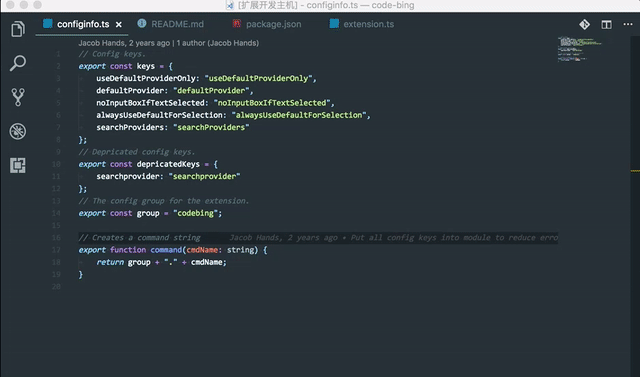

# Edu Module Doc :rocket:

> 快速查看教育云工程的`README`以及`CHANGELOG`. 项目主要来源于[edu-front-spec](https://g.hz.netease.com/edu-front-spec),[edu-front-vendor](https://g.hz.netease.com/edu-front-vendor),[edu-frontend](https://g.hz.netease.com/edu-frontend)`GitLab` 小组.

## 安装

在VSCode中按下`F1`，输入`ext install`，然后查找`Edu Module Doc`。

## 快捷键

#### 查看README

快速唤醒插件. Mac -> `alt+cmd+k`  Win -> `shift+alt+k`

#### 查看CHANGELOG

快速唤醒插件. Mac -> `ctrl+cmd+k`  Win -> `ctrl+alt+k`


## 使用



## 支持的操作系统

```
Windows, Linux, MacOS
```

## 感谢

* [VSCode](https://code.visualstudio.com/)


## 开源协议

[MIT](LICENSE)
